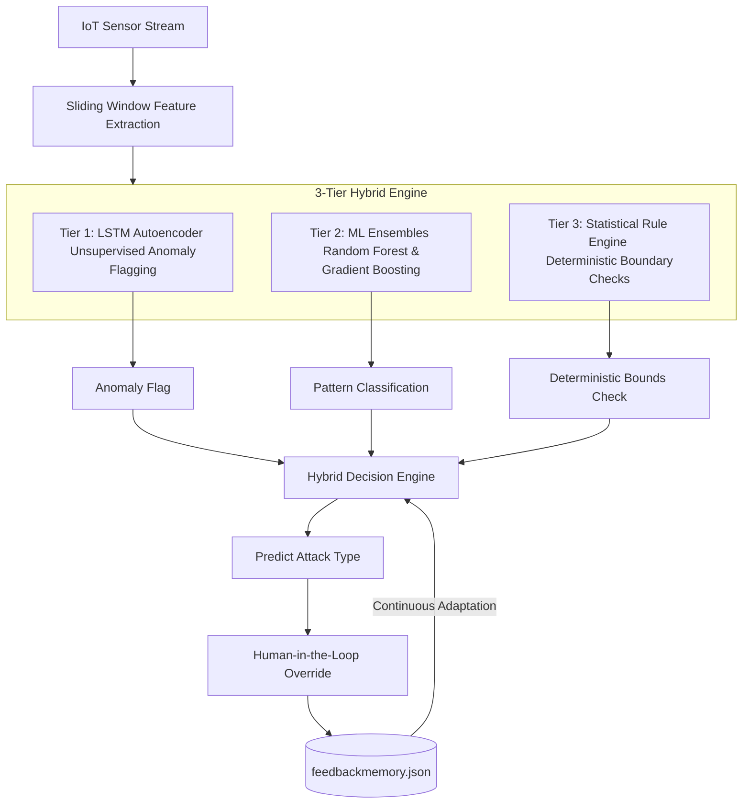

# 🏢 Resilient IoT Intrusion Detection System for Smart Buildings

A high-performance, real-time hybrid security framework for detecting, classifying, and mitigating adversarial attacks on IoT sensor networks (such as DHT11 temperature & humidity sensors) in smart building environments.

---

## ⚡ Key Upgrades (June/July 2026)
*   **78.10% Overall Accuracy** on multi-sensor streams.
*   **100% Precision Replay & Drop Detection** with zero false alarms.
*   **93.85% Noise Attack Recall** using normalized Shannon entropy.
*   **Interactive Web UI Dashboard** built with Streamlit and Plotly.
*   **Human-in-the-Loop Feedback Engine** for continuous adaptive learning.

---

## 🛠️ Technical Rationale: Why LSTM, DHT11, and the Smart Building Edge

### 🧠 Why the LSTM Autoencoder?
*   **Designed for Sequential Temporal Data:** Temperature and humidity readings from IoT sensors are not isolated events; they form highly correlated temporal sequences (time-series). LSTM (Long Short-Term Memory) cells possess recurrent feedback connections, enabling the model to learn long-term temporal dependencies and establish a reliable behavioral baseline of normal room shifts.
*   **Edge-Ready & Low Computation:** Traditional deep learning models (like Transformers) are computationally expensive and memory-heavy. An LSTM Autoencoder (configured with 64 and 32 hidden units) offers a lightweight, energy-efficient profile suitable for on-device deployment on resource-constrained **Edge/IoT gateways (such as a Raspberry Pi 4)**. It guarantees low-latency, real-time inference at the edge without relying on constant cloud communication.
*   **Unsupervised Anomaly Detection:** Real-world network and sensor attacks are constantly evolving, meaning labeled datasets of all future attacks do not exist. An Autoencoder trains *only* on normal operational data, flagging anomalies purely based on elevated reconstruction error (MSE), making it highly resilient to zero-day (previously unseen) attacks.

### 🌡️ Why the DHT11 Sensor? (HVAC Simulation)
*   **HVAC Climate Regulation:** The DHT11 temperature and humidity sensor is the industry standard for smart climate monitoring. We specifically selected the DHT11 because temperature and humidity are the primary feedback control variables used to regulate **HVAC (Heating, Ventilation, and Air Conditioning) systems** in smart buildings.
*   **The Threat Vector:** By injecting falsified readings into a DHT11 stream (e.g., simulating extreme heat or zero humidity), an attacker can force a centralized HVAC system to over-cool, over-heat, or run continuously. This results in:
    1. Massive energy waste and electrical strain on the building.
    2. Severe occupant discomfort.
    3. Accelerated wear-and-tear or physical destruction of HVAC compressor/blower hardware.
*   Simulating DHT11 compromises provides a direct, high-fidelity model of real-world HVAC system attacks and enables us to validate real-time mitigation before physical damage occurs.

---

## 🌐 Perspective: The Inevitability of IoT and the Cybersecurity Paradigm Shift

### ⚖️ The Paradox of Comfort vs. Control
> *"One day, someone might lock you inside your own house."*
>
> In the early days of network architecture, smart devices and environmental sensors were never intended to be connected to the public internet. The rapid rise of the Internet of Things (IoT) introduces billions of interconnected nodes, translating to a broader data footprint and increased potential for remote control over our private spaces.
> 
> However, there is no turning back. It is human nature to gravitate toward comfort. There is an undeniable ease in having your room temperature managed automatically based on your daily habits while you are sitting in your office or resting in bed. Because this convenience is irresistible, the expansion of IoT is inevitable—and by extension, so is the rise of sophisticated cyber attacks targeting these entry points.

### 🛑 Moving from Reactive to Proactive Defense
Historically, cybersecurity has operated as a **reactive rescue mission**: an intrusion occurs, systems fail, and security professionals are called in post-incident for damage control. In critical smart building environments, this model is insufficient. 
*   **The Real-Time Solution:** We require a centralized, real-time system that continuously monitors network packets and sensor values to predict anomalies before they manifest, safeguarding public and private property.
*   **Comfort & Active Resilience:** By combining automated AI predictions with deterministic rule filtering, our system achieves both optimal environmental comfort and active resilience against data tampering.
*   **Human-in-the-Loop Safeguards:** Because absolute automation carries the risk of false-alarm locks or unauthorized overrides, our architecture integrates a human supervisor. This ensures that automated mitigations remain grounded by expert validation, creating a collaborative shield of machine speed and human oversight.

---

## ⚠️ Real-World Security Threat & Mitigation
In **December 2023 (Ireland)**, cyber attackers targeted European water utility infrastructure, accessing internal supervisory systems via exposed IoT gateways. By tampering with sensor streams, the attackers attempted to manipulate water levels, flow meters, and **chemical dosing values** to trigger physical utility failures. 

Traditional signature-based firewalls cannot detect these stealthy, low-and-slow manipulations. This project secures smart buildings against similar attacks in real time by continuously monitoring a **sliding window of sensor readings** (size = 30) and extracting key statistical features to block compromises at the edge:

*   **`temp_slope` (Trend):** Captures gradual shifts over time to block **Drift Attacks**.
*   **`temp_std` (Variance):** Differentiates between flat stuck values (**Drop Attacks**) and high-frequency fluctuations (**Noise Attacks**).
*   **`temp_range` (Spread):** Measures full peak-to-peak swings to identify **Injection Attacks**.
*   **`temp_entropy` (Shannon Entropy):** Detects elevated randomness and high-frequency noise profiles.
*   **`temp_max_jump` & `temp_spike`:** Identifies sudden absolute value deviations (spikes) indicative of malicious data injections.

---

## 🧠 3-Tier Defense Hybrid Architecture
No single detection technique is sufficient for advanced attacks. This system fuses three independent layers to achieve robust resilience:



1.  **Tier 1: Unsupervised LSTM Autoencoder (Unsupervised Learning)**
    *   Trained exclusively on normal sensor data to establish a baseline of healthy building behavior.
    *   Compresses sequences (`LSTM 64 → LSTM 32`) and reconstructs them.
    *   Anomalies are flagged when the Mean Squared Error (MSE) reconstruction error exceeds a dynamic `3-sigma` threshold (`Mean + 3 * Std`).
2.  **Tier 2: Supervised ML Ensembles (Pattern Classification)**
    *   **Random Forest:** Acts as the primary pattern learner, mapping sequence features (slope, std, range, entropy, spikes, jumps) to attack classes.
    *   **Gradient Boosting:** Refines predictions for complex patterns by focusing on errors.
    *   **Isolation Forest:** Operates in parallel to flag novel, unseen anomaly distributions.
3.  **Tier 3: Deterministic Rule Engine (Edge Case Defense)**
    *   Runs alongside ML to catch clear physical limits.
    *   *Injection Attack Rule:* Triggered if `max_jump > 5.0°C` or `zscore_max > 5.0`.
    *   *Replay Attack Rule:* Pattern correlation similarity matches matching old history signatures.
    *   *Drift Attack Rule:* Triggered when `abs(slope) > drift_threshold` (0.05).
    *   *Drop Attack Rule:* Triggered if `std < 0.1` and `range < 0.4` (freeze detection) or `slope < -0.15` (step drop).
    *   *Noise Attack Rule:* Triggered if `std > 2.0` and `entropy > 1.5`.

---

## 🔄 Human-in-the-Loop Continuous Learning Loop
To prevent AI hallucinations and adapt to seasonal building operations, the framework incorporates a **Continuous Feedback Learning Loop**:

1.  **System Prediction:** The model analyzes a sensor window and outputs a prediction (e.g., `Noise Attack | Confidence: Medium`).
2.  **User Review:** The administrator reviews the prediction via the Streamlit dashboard and overrides the label if it is a false positive.
3.  **Memory Storage:** Corrected feature vectors and their target labels are stored in `feedbackmemory.json`.
4.  **Instant Matching:** For subsequent inferences, the classification engine checks the feedback database for similar historical patterns, bypassing model errors and automatically correcting similar alerts in the future.

---

## 📊 Performance Evaluation Matrix
Validation results comparing the system before and after the June/July 2026 bug patches:

| Metric | Before Patches | After Patches (Patched Engine) |
| :--- | :--- | :--- |
| **Overall Accuracy** | 52.48% | **78.10%** |
| **Normal Recall** | 64.18% | **90.16%** (Precision: 94.03%) |
| **Noise Attack Recall** | 0.00% | **93.85%** (Precision: 64.21%) |
| **Drift Attack Recall** | 28.03% | **43.80%** (Precision: 55.21%) |
| **Replay Attack Precision**| 0.00% | **100.00%** (Caught all replayed instances) |
| **Drop Attack Precision** | 0.00% | **100.00%** (Caught onset drops and freezes) |

---

## 📂 Project Structure

```
Preventing-Wrong-Decisions-in-Smart-Building-Systems/
├── README.md                                                 # Project Documentation
├── SECURITY.md                                               # Security reporting guidelines
│
├── Preventing-Wrong-Decisions-in-Smart-Building-Systems-IBM/ # 🚀 Patched Production Codebase
│   ├── app.py                                                # Streamlit UI monitor dashboard
│   ├── hybrid_iot_ids.py                                     # Core decision engine
│   ├── feedback_engine.py                                    # Feedback database manager
│   ├── run_hybrid_demo.py                                    # Automated demo pipeline
│   ├── test_hybrid_iot_ids.py                                # Unit test suite
│   ├── enhanced_iot_dataset_3sensors.csv                     # Multi-sensor active dataset
│   ├── feedbackmemory.json                                   # Pre-seeded feedback overrides
│   ├── IMPLEMENTATION_SUMMARY.md                             # Enhanced metrics summary
│   ├── detection/                                            # Replay and config submodules
│   ├── features/                                             # Feature extraction submodules
│   └── DataSet Gen/                                          # Dataset generator scripts
│
├── Aman_cybersecurity/                                       # Aman's original security scripts
│   ├── detect.py                                             # Original rules script
│   ├── attacks.py                                            # Original attacks simulator
│   └── cyber_output.pages                                    # Research documentation
│
├── database/                                                 # Raw datasets & logs
│   ├── dht11_dataset_10000.csv                               # Original 10k single-sensor dataset
│   └── log_temp.csv                                          # Temperature log data
│
└── archive/                                                  # Archived exploratory work
    └── dht11-anomaly-detection-lstm-ae-replay-attack.ipynb   # Jupyter notebook
```

---

## 🚀 How to Run

### 1. Install Prerequisites (Python 3.13 recommended)
```bash
pip install pandas numpy scikit-learn tensorflow streamlit plotly matplotlib
```

### 2. Navigate to the Production Codebase
```bash
cd Preventing-Wrong-Decisions-in-Smart-Building-Systems-IBM
```

### 3. Run the Interactive Dashboard Web UI
```bash
streamlit run app.py
```

### 4. Run the Automated Simulation Demo
```bash
python run_hybrid_demo.py
```

### 5. Run the Automated Unit Tests
```bash
python -m unittest test_hybrid_iot_ids.py
```

---

